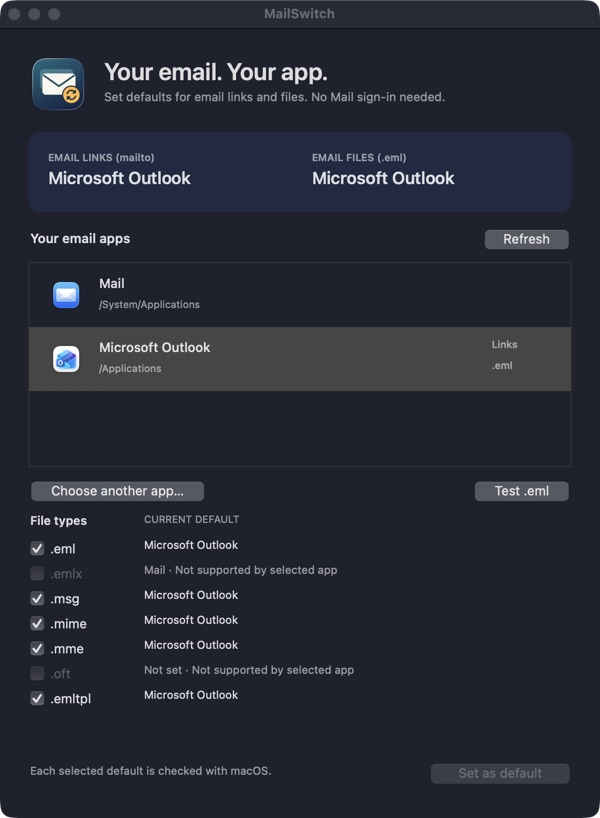

<h1 align="center">MailSwitch</h1>

Choose your default email app on macOS. No Apple Mail sign-in needed.

Open source · MIT license · Intel + Apple Silicon

## What does it do?

MailSwitch finds your installed email apps and lets you choose which one opens
email links and saved messages. macOS keeps these settings separate: Outlook can
open email links while Apple Mail still opens `.eml` files. MailSwitch handles both.

## Use it in a few clicks

1. Download **MailSwitch.app.zip** from [Releases](https://github.com/semihiyiguen/MailSwitch/releases), unzip it and open MailSwitch.
2. Select your email app and leave the file types you want to change checked.
3. Click **Set as default**. MailSwitch checks the result with macOS.
4. Optionally click **Test .eml** to open a harmless sample message. Nothing is sent.

**Download status:** current development builds are ad-hoc signed, not yet
Apple Developer ID signed or notarized. macOS may block their first launch.
If you trust the downloaded release and macOS blocks it, go to **System Settings
→ Privacy & Security**, scroll to **Security**, then click **Open Anyway** and
confirm. macOS may ask for your login password; managed Macs may require an
administrator or IT approval. This is a one-time exception for the app, not a
request for access to your mail. [Apple's instructions](https://support.apple.com/en-us/102445).
Do not disable Gatekeeper. A notarized package will be identified explicitly in
its release notes. [Signing and distribution](docs/SIGNING.md).

## Supported formats

Email links (`mailto:`), `.eml`, `.emlx`, `.msg`, `.mime`, `.mme`, `.oft` and
`.emltpl`. Only formats supported by the selected app are enabled. MailSwitch
changes defaults; it does not convert messages or add support to an email client.

Intel builds target macOS 10.15+, Apple Silicon builds target macOS 11+.
There is no maximum OS-version restriction. Every older or future macOS release
has not been tested. [Compatibility and troubleshooting](docs/TECHNICAL.md).

## Privacy and open source

- No account, telemetry, network requests or mailbox scanning.
- Default changes use public macOS APIs and respect system policy.
- All application code, build scripts and tests are included under the [MIT license](LICENSE).
- The optional test opens only the included synthetic email.

If a change fails, **Details** explains it. Select your previous app to switch
back. Files with their own Finder override may need their **Open with** setting
changed separately.

[Build from source](docs/TECHNICAL.md#build-from-source) ·
[Security policy](SECURITY.md) · [Test scope](docs/VALIDATION.md) ·
[Contributing](CONTRIBUTING.md) · [Changelog](CHANGELOG.md)

Not affiliated with Apple or Microsoft.
